# Chatbot App Sentiment Analysis

## Table of Contents

-[Background](#background)

-[Objective](#objective)

-[Limitation](#limitation)

-[Flowchart](#flowchart)

-[Data Source](#data-sources)

-[Tools and Libraries](#tools-and-libraries)

-[Exploratory Data Analysis](#exploratory-data-analysis)

-[Preprocessing](#preprocessing)

-[Machine Learning Result](#machine-learning-result)

-[Conclusion](#conclusion)

-[Reference](#references)

-[Appendix A: Feature Explanation](#appendix-a-feature-explanation)

-[Appendix B: Visualization](#appendix-b-visualization)

-[Appendix C: Build a Sentiment Model](#-appendix-c-build-a-sentiment-model)

---

## Background
When launching a new product, companies seek to understand its usefulness and reception among users. Feedback often comes in the form of written reviews, typically posted in the comments section of apps or across social media platforms. These user-generated texts contain valuable insights into customer satisfaction, expectations, and pain points. To extract and interpret this information at scale, data scientists apply sentiment analysis techniques, transforming raw opinions into structured insights. One relevant example is the ChatGPT app on Google Play, where thousands of reviews reflect user sentiment toward its performance and utility.

Sentiment analysis, also known as opinion mining, is a subfield of Natural Language Processing (NLP) that focuses on identifying and extracting subjective information from text, enabling organizations to make data-driven decisions based on public perception. This project will review the analysis techniques like lexicon and Long-Short Term Memory (LSTM) used while providing readers with insight into the sentiments given by Google App users to the several AI chatbot application. The three chatbot applications that will be used in this project are ChatGPT, Claude, and Deepseek.

## Objective

The goal of this project is:

1. Comparing the result of the lexicon and LSTM sentiment analysis model,

2. Comparing the sentiment analysis results of the three chatbots with the two models, and

3. Conduct exploratory data analysis on user reviews from three chatbot applications to reveal sentiment patterns and distributions.

## Limitation
The limitation of this project are

- This project is limited to three chatbot applications and two sentiment analysis models.

- The amount of review data gathered so far is still quite limited.

## Flowchart

The workflow for this project can be seen in the image below. After data have been harvested, the next process is preprocessing. This step overall contains 3 process, cleaning, remove stopwords, and tokenization. Sentences that could interfere with the analysis need to be removed, such as case folding (changing all letters to lowercase), unintentional extra spaces, numbers, and extra letters. After that, the next step is to remove stopwords, some unnecessary words in a phrase, such as "and," "or," "also," and so on. Tokenization is the process of breaking a phrase into smaller parts. This is the final stage of preprocessing.

<p align = center>
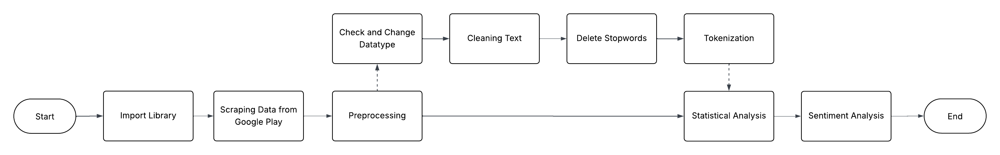
</p>

## Data Source
This data was scrapped by using `google-play-scraper`. This data contains `date`, `ratings`,` review_id`, `username`, and `review text`. The `date` columns contains the date when the review wrote from user. Reviewer identity can be represented by `review_id` and `username`. The user opinion and score can be seen on `review text` and `ratings`, respectively.The amount of data obtained from the scraping results for Deepseek, Claude, and ChatGPT is at 3985, 812, and 20000 data, respectively.

## Tools and Libraries
The tools I used in this Google Colab and Google Play Scraper. The version of python, main programming languange, is 3.12.11. The libraries are:

- Seaborn 0.13.2
- Numpy 2.0.2
- Matplotlib 3.10.0
- Tranformer 4.55.2 
- NLTK 3.9.1
- Pandas 2.2.2
- re 2.2.1 (Regular Expression)

## Exploratory Data Analysis

Before carrying out exploration, the project data is cleaned first according to the workflow in the image [Flowchart](#flowchart).

### Total Sentiment based on the Google Play Rating

<p align = center>
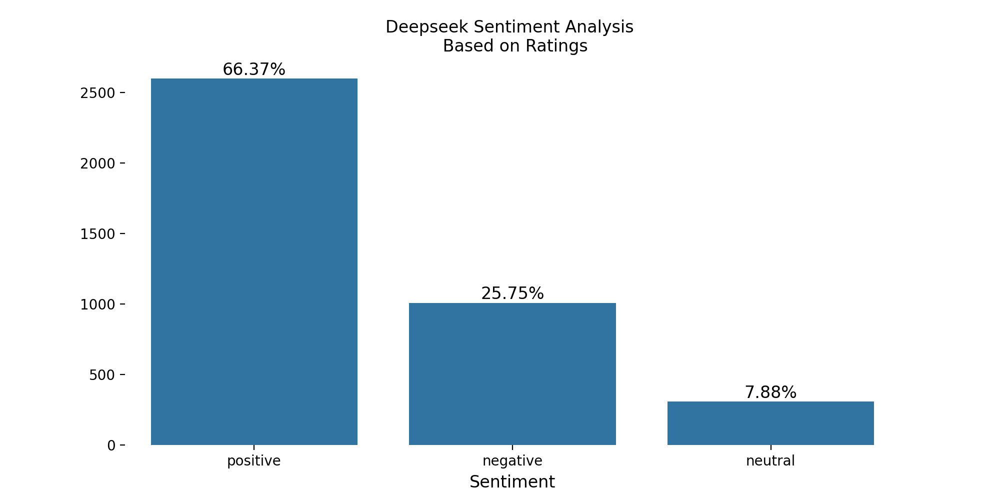
</p>

<p align = center>
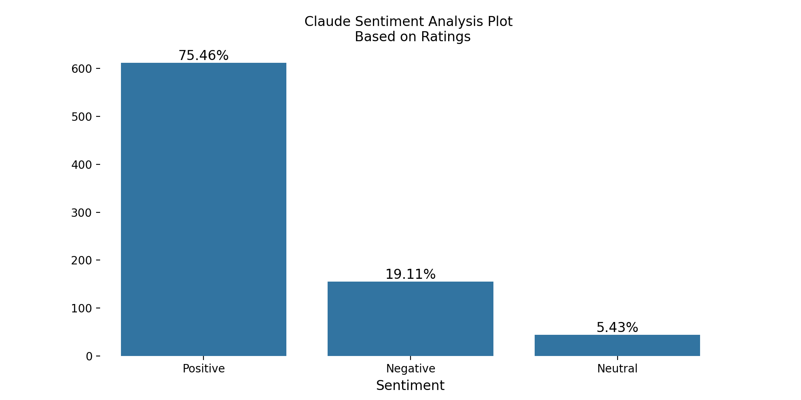
</p>

<p align = center>
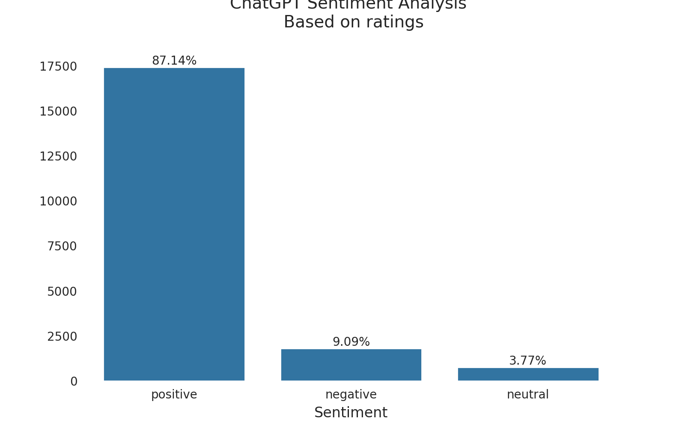
</p>


- Rating on Google Play is star-based system (1-5 stars) reflecting user satisfaction with apps. IIn this project, if a reviewer gives a rating above 3 stars, the sentiment is considered positive, while 3 stars and below are considered neutral and negative, respectively. The results, based on the image above, show that all chatbot apps have a high level of positive sentiment, regardless of the number of reviews they receive. However, if we look at non-positive sentiment, negative sentiment is the second highest.

### Daily Sentiment Trends

<p align = center>
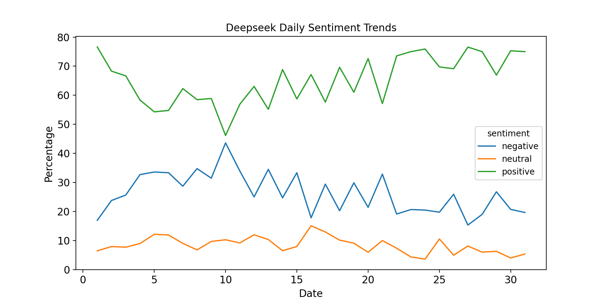
</p>

<p align = center>
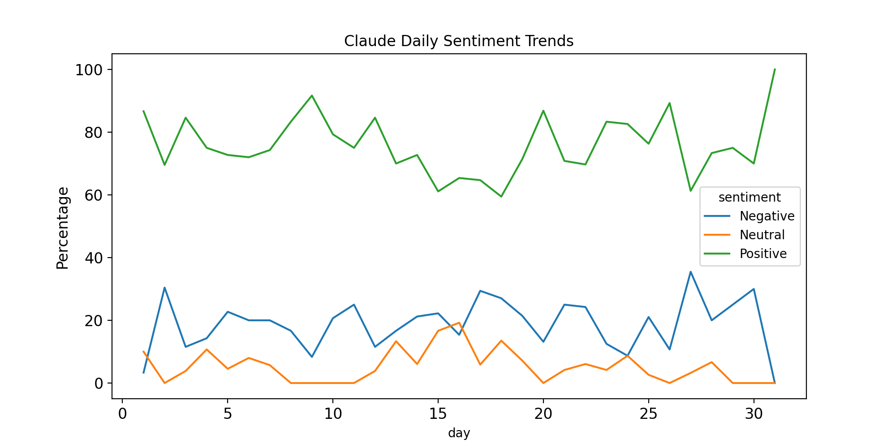
</p>

<p align = center>
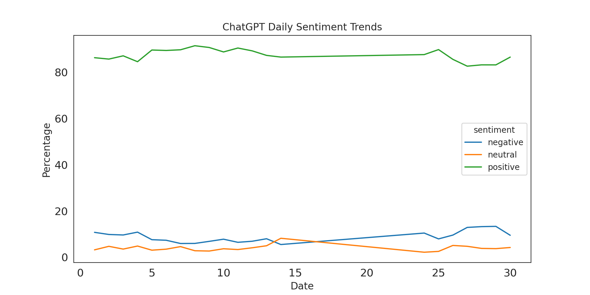
</p>

- The three figures above show sentiment trends over time. Positive sentiment (green) is clearly the highest over the month. However, there is a clear divergence in the numbers of negative (blue) and neutral (orange) sentiment in the Deepseek chatbot app, suggesting a fundamental issue with the user experience or expectations that requires further investigation.

### Length Distribution

<p align = center>
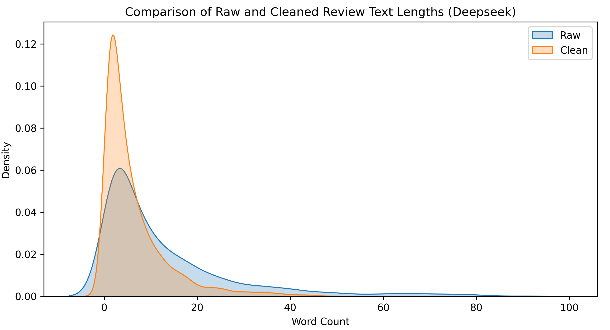
</p>

<p align = center>
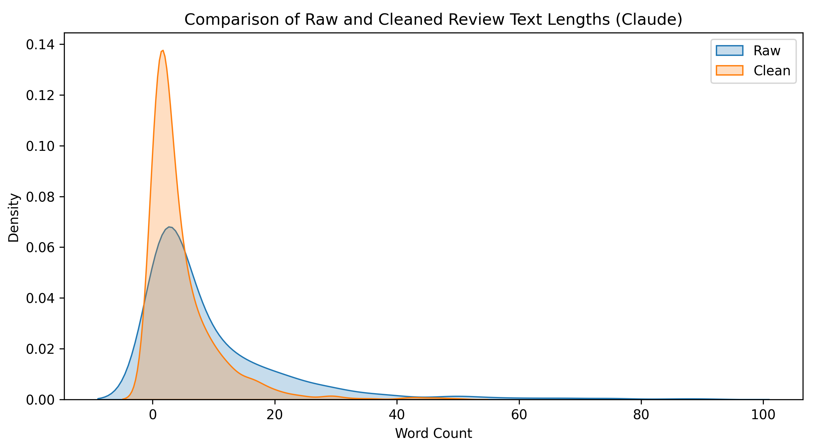
</p>

<p align = center>
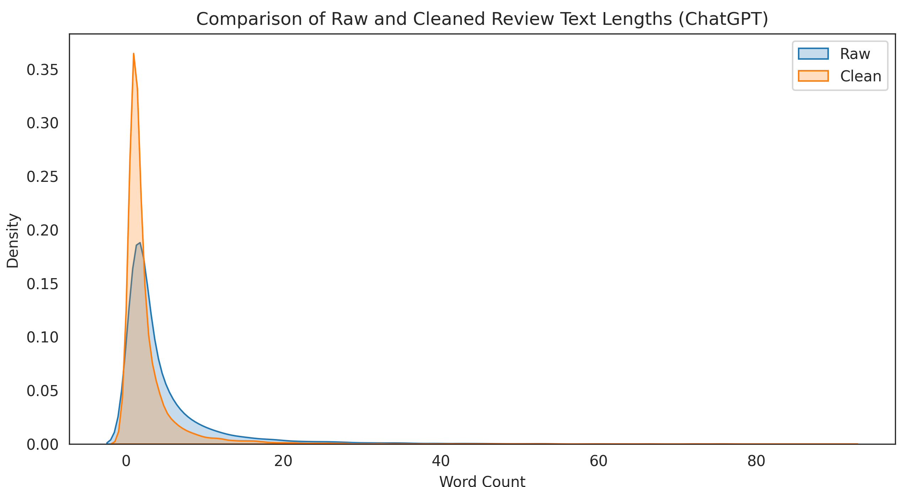
</p>

- The image above shows the distribution of word length before and after preprocessing. The blue distribution curve shows the distribution of word lengths before the cleaning phase, which is slightly wider than the orange curve, which represents the length of the cleaned text. Both curves converge towards zero, indicating a high number of empty reviews. The blue curve is shorter than the orange one, indicating a lower number of empty reviews.

- Both distribution curves show positive skew, but the raw data has a longer right tail than the cleaned version, meaning more long reviews remain before cleaning.  

### Word Cloud: Overall

Word Cloud is a visualization that represents the frequency of occurrence of words with letter size. Word size reflects the number of times the word appears. The larger the word, the more frequently it appears in app reviews.

<p align = center>
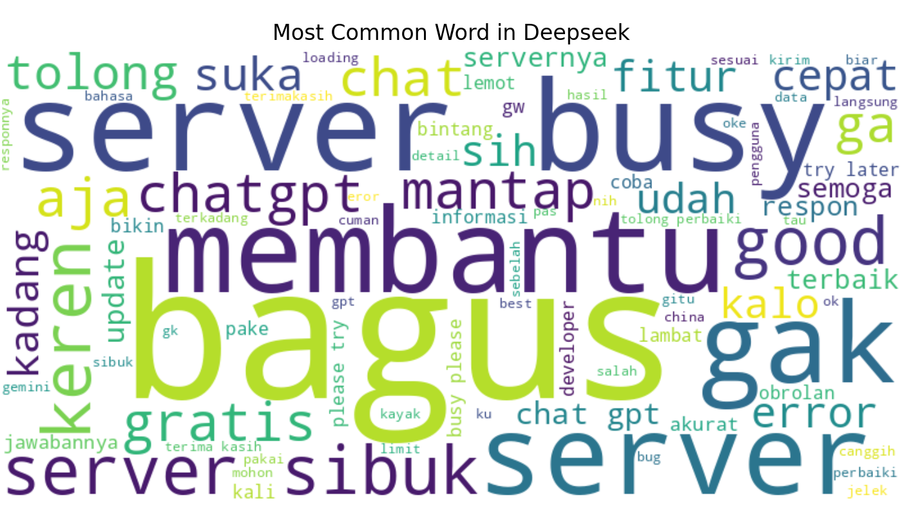
</p>

<p align = center>
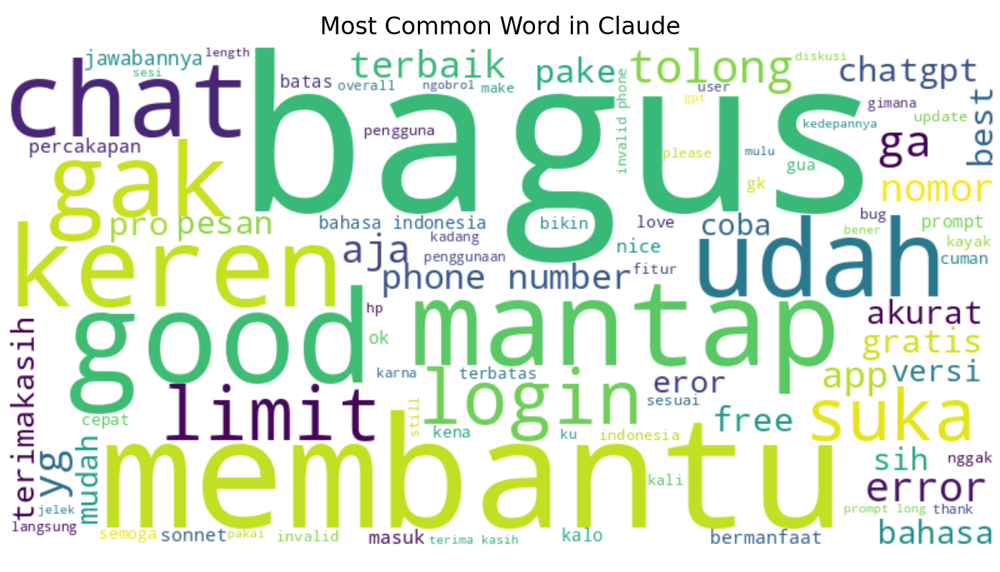
</p>

<p align = center>
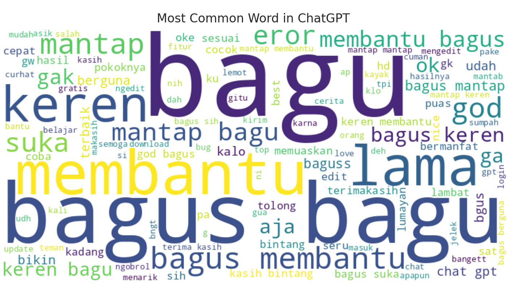
</p>

- **Overall Sentiment**: The word cloud image above represents a collection of frequently encountered words from users. Overall, the three chatbot applications can be considered effective in engaging users. After examining the overall sentiment, we will next discuss the non-positive (neutral and negative) aspects through a word cloud visualization.

### Word Cloud: Non-Poistive

<p align = center>
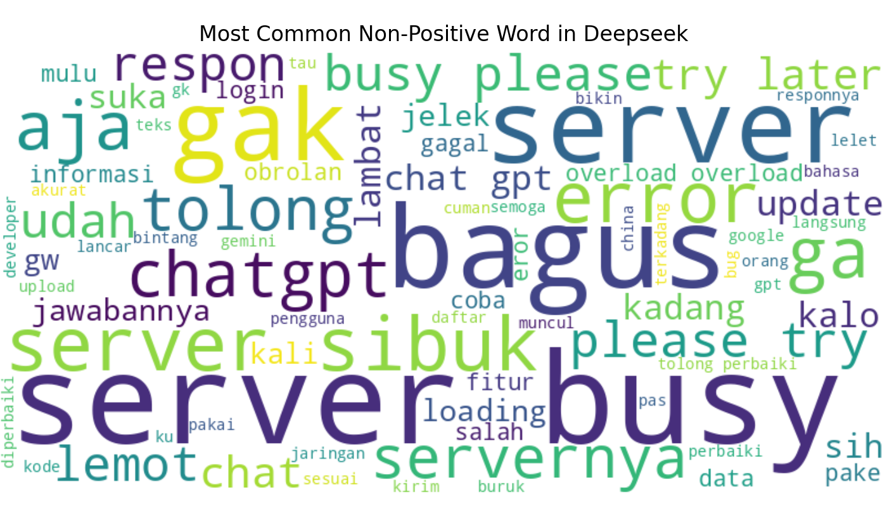
</p>

- **Deepseek**: Words frequently appearing in non-positive sentiments include *server*, *busy*, and *sibuk* (same as *busy*), indicating that the chatbot is experiencing server issues. This issue arises from high user demand and limited server capacity. Deepseek needs to address these infrastructure issues.

<p align = center>
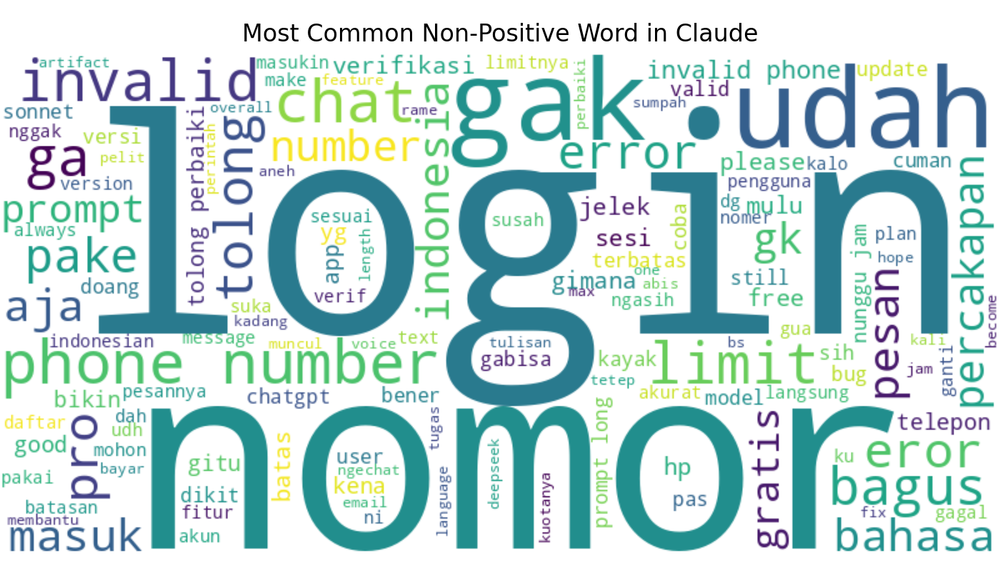
</p>

- **Claude**: Users who expressed negative sentiment toward this app often mentioned the words *login* and *nomor* (number). This was because several customers experienced login problems when their phone numbers were incorrectly flagged as invalid. There are several possible causes such as overly strict number formatting rules, geographic restrictions by the developer, or server issues.

<p align = center>
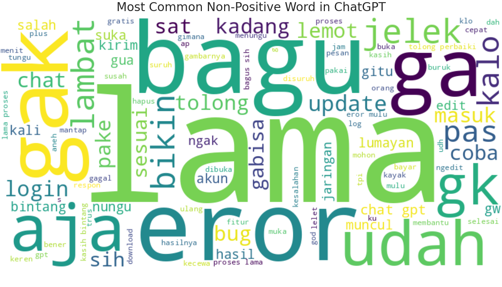
</p>

- **ChatGPT**:The visualization above shows the words "lama" and "error," indicating that users are complaining about slow prompt execution and frequent errors. This is likely due to inadequate system optimization, where a large computational workload, hardware limitations, or inefficient code execution create bottlenecks that slow response times and increase the likelihood of errors.

## Preprocessing

Preprocessing, in Natural Language Processing (NLP), is the process of cleaning data of unnecessary elements before conducting sentiment analysis. This is necessary to prevent phrases considered "noise," such as punctuation and repeated letters, from interfering with the analysis. In this project, this process was performed before exploratory data analysis. Some of the necessary steps include text cleaning, stopword removal, and tokenization.

### Text Cleaning

Text cleaning involves reducing the font size, removing punctuation, extra letters in words, and extra spaces. After cleaning, the average character count will be dropped.

- **Deepseek**: The average word count for a review is 80 characters. After cleaning, that number was reduced by 2.5 chars (77.5 chars in average). 

- **Claude**: The average character count for this app review was 58.1. After cleaning, that number sligthly dropped to 56.5.

- **ChatGPT**: The average number of characters before the cleaning process was 31. After the cleaning process, the number dropped to 29.8.

### Stopwords Removal

Stopwords are the most frequently occurring letters, or the most common, such as 'dan', 'atau', 'apk', and so on, which have almost no meaning at all. These letters are considered noise in the keywords in the review sentence, so they are often filtered out. This project includes several different stopwords for each application.

```python
# Deepseek
# create custom stopwods
stop_words_id = set(stopwords.words('indonesian'))
id_stopwords = {'dan', 'yang', 'atau', 'apk', 'aplikasinya', 'aplikasi', 'nya', 'juga', 'atau', 'ai', 'foto', 'analisa', 'gambar', 'deepseek', 'banget', 'bgt', 'ya', 'yg',' fitur'}

# discarded some stopwordss
discarded_stopword = {'luar', 'biasa'}
```

```python
# Claude
# add custom stopwords
stop_words_id = set(stopwords.words('indonesian'))
id_stopword = {'dan', 'yang', 'atau', 'apk', 'aplikasinya', 'aplikasi', 'nya', 'juga', 'tau', 'atau', 'ai', 'foto', 'AI', 'analisa', 'gambar', 'claude', 'banget', 'bgt', 'ya'}

# add english stopwords
stop_words_en = set(stopwords.words('english'))
```

```python
# ChatGPT
# create custom stopwords
stop_words_id = set(stopwords.words('indonesian'))
custom_stopwords = {'dan', 'yg', 'atau', 'apk', 'aplikasinya', 'aplikasi', 'juga', 'nya', 'tau', 'apknya', 'ai', 'foto','analisa', 'gambar', 'chatgpt', 'banget', 'bgt','ya'}
stop_words_id.update(custom_stopwords)
stop_words_id.remove('lama')
```

After using these stopwords, the number of chars in user reviews will decrease. The word count calculation below is obtained by dividing the average number of words after the cleaning process by the average number after the stopword removal process.

$$\Delta length \space chars = avg.\space length\space cleaning\space process - avg.\space length \space stopwords \space removal$$

- **Deepseek**: Average loss 33.4 chars (from 75.5 to 43). 

- **Claude**: Average loss 24.3 chars (from 56.5 to 32.2).

- **ChatGPT**: Average loss 12.8 chars (from 29.8 to 17 chars).


## Sentiment Method Result

### Lexicon-based Analysis

A lexicon analysis, in Natural Language Processing, is an analysis by using vocabulary related to the object being analyzed. This technique serves as a repository of linguistic knowledge that allows machines to learn to understand the positive and negative aspects of a word or phrase. The lexicon methodology in this project follows the principles of manual curation as described in Hutto & Gilbert's (2014) study on heuristic rules, but is independently adapted to address the unique characteristics of Indonesian and English language reviews. The advantage of lexicon method analysis is that it is not only computationally efficient, but also does not require training data like machine learning. Moreover, this method is transparent, which means we can add, remove, or change the scores of certain words in the dictionary according to the needs of the specific domain. However, with these advantages, this model is highly dependent on dictionaries, which means that dictionaries cannot capture the context of the entire word. This project uses several words as references, as shown in the Python code below.

```python
sentiment_lexicon_id = {'bagus': 1, 'baik': 1, 'keren': 1, 'mantap': 1, 'membantu': 1, 'canggih':1,'terbaik':1, 'jelek': -1, 'buruk': -1, 'lama': -1, 'error': -1, 'susah': -1, 'eror':-1, 'bug':-1, 'gabisa':-1, 'aneh':-1, 'berbayar':-1, 'bayar':-1, 'memburuk':-1, 'menurun':-1, 'biasa': 0, 'netral': 0}

sentiment_lexicon_en = {'good': 1, 'bad':-1, 'best':1, 'worst':-1, 'better':1}
```

Since a few users use English to give their opinions, a lexicon of that language is necessary for machine recognition. The results of the lexicon analysis on the three applications can be seen in the image below.

<p align = center>
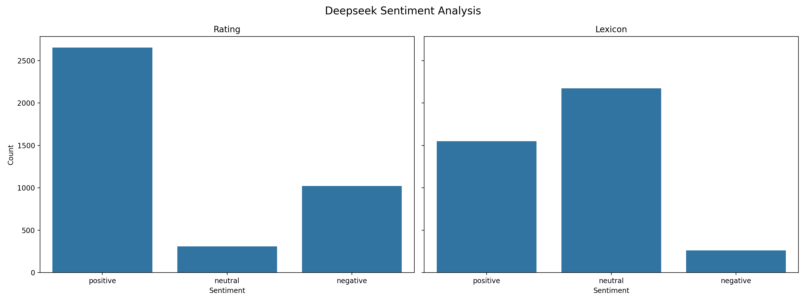
</p>

<p align = center>

</p>
 
<p align = center>
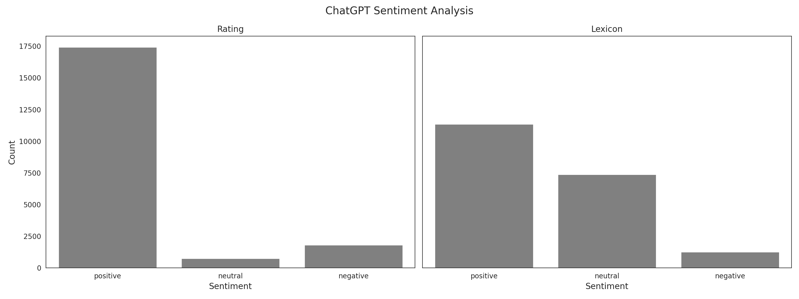
</p>

- **Overall**: A lexicon containing these words can capture some positive and negative sentiments, the remaining unreadable words will be considered neutral. The number of neutrals is significantly higher than the number of neutrals based on ratings in all chatbot app reviews. Those are likely due to:

1. Empty reviews due to preprocessing.
2. The vocabulary content in the dictionary does not cover all the vocabulary in the review.
3. The language used by users to write reviews is outside of Bahasa or English.
4. There is one sentence that has two words with opposite sentiments.

### Recurrent Neural Network and Long Short Term Memory (LSTM)

Processing sequential data requires an algorithm that can store or recall information from one instance for later use. Therefore, artificial neural networks need to add loop connections containing this information, creating a Recurrent Neural Network (RNN). The number of loops depends on the richness of the information being collected. A single RNN can be thought of as multiple copies of the same artificial neural network, each passing information to its successor neural network.

Artificial neural network models are typically divided into three layers, input, hidden, and output. Based on the figure below, the input layer contains inputs in the form of sequences of words that have been converted into vectors, while the output layer contains class probabilities, the likelihood of whether the output is positive or negative. The hidden layer contains artificial neural models, one of which is Long-Short Term Memory (LSTM).

<p align = center>
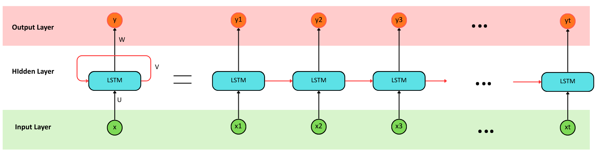
</p>

**LSTM**, located in the hidden layer, is a type of artificial neural network belonging to the recurrent neural network (RNN) category used to understand sequential data such as text, speech, and time series. This artificial neural network has better data processing capabilities than standard RNNs because it can remember important information long-term and ignore irrelevant information.LSTM consists of 2 parts, the *cell state* and the *hidden state*. *Cell state* is the primary flow of information controlled through gates. It acts as a long-term memory that carries important information across long time steps.

<p align = 'center'>
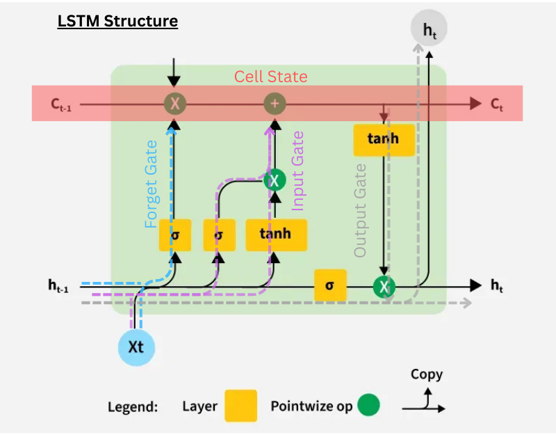
</p>

*Hidden state* $h$ is a "filter" version of *cell state* $C$, which not only produces recent output, but also as a short term memory for the next step, because it has 3 gates, input $i$, output $O$, and forget $f$ gate.

**Forget Gate**: The first stage in LSTM is to decide whether the incoming information should be kept or discarded. This decision is made by a layer or gate that has a sigmoid activation function $\sigma$ called the Forget Gate. Because it is related to the sigmoid, the output of this gate is a probability close to 0, aka "forget or discard this information from the cell state $C_t$ ", or close to 1, "keep this information in the cell state $C_t$". The Forget Gate $f_t$ can be expressed as

$$f_t = \sigma(W_f . [h_{t-1}, x_t] +b).$$

**Input Gate**: This gate is used to update the old cell state $C_{t-1}$ with input data in the form of the hidden state from the previous cell state, $h_{t-1}$, and new information $X_t$. The input gate has two paths, the path containing the sigmoid function for recent input $i_t$ and the one with the hyperbolic tangent (tanh) for the candidate cell state $\tilde{C}_t$. The update method can be done using the equation

$$C_t = f_tC_{t-1} + i_t\tilde{C}_t$$

where $f_t$ is the *forget gate* function, $C_{t-1}$ is the cell state with previous information, and $i_t$ is the *input gate* at time $t$ containing the equation 

$$i_{t} = \sigma(W_i*[h_{t-1}, x_t] + b_i)$$

The $W_i$ represent weight for *input state*, $h_{t-1}$ is previous *hidden state*, $b_i$ is the bias for input,and $x_t$ is the current input. The *cell state candidate* $\tilde{C}_t$ dapat dihitung dengan persamaan

$$\tilde{C}_t = tanh(W_C * [h_{t-1}, x_t] + b_C)$$

where $W_C$ represents weight for *cell state* dan $b_C$ is bias for the state. If we go back to the equation for $C_t$, we multiply the old cell state by the forget gate $f_t$, forgetting the things we decided to forget earlier. Then, we multiply the input gate $i_t$ by the candidate cell state $\tilde{C}_t$. The candidate is scaled by how much we decide to update each state value.

**Output Gate**: As the name suggests, this gate functions as an output in the form of the current hidden state value $h_t$. This value comes from the combination of the current cell state $C_t$ that has passed through two gates, input and forget, with the input $x_t$ and the previous hidden state value $h_{t-1}$. The equation for the output gate is

$$O_t = \sigma(W_o *[h_{t-1}, x_t] + b_o)$$

where $W_o$ is *output weight* and $b_o$ is *bias output*. The latest *hidden state* can be expressed by the equation

$$h_t = O_t tanh(C_t).$$

We see several activation functions in the LSTM structure, **sigmoid** and hyperbolic tangent (**tanh**). Activation function is a mathematical function that is used to produce output from a neuron. Sigmoid is a non-linear function that change any input to probability from 0 to 1. The function forms S-shaped curve in the lineplot. The formulation of this activation function is 

$$\sigma(x) = \frac{1}{1 + e^{-x}}.$$

Hyperbolic tangent is the activation function in the neuron that converts any input into a value between -1 and 1. Just like the sigmoid, this function also forms an S curve. The tanh equation is

$$tanh(x) = \frac{sinh(x)}{cosh(x)} = \frac{e^{x} - e^{-x}}{e^{x} + e^{-x}}$$

where hyperbolic sine ($sinh$)

$$sinh(x) = \frac{e^{x} - e^{-x}}{2}$$

and hyperbolic cosine ($cosh$)

$$cosh(x) = \frac{e^{x} + e^{-x}}{2}.$$

In artificial neural networks, training relies on backpropagation, where a gradient (error signal) is propagated backward through layers. Backpropagation itself is an algorithm in artificial neural networks that aims to minimize error by updating weights and biases after calculating the error (or loss) obtained from the output. Loss function is a mathematical tool that quantifies the error or "loss" or "cost" between model's predicted output and actual (true) output. The letters U, V, and W are respectively *input weight* $w_i$, *hidden weight* $w_h$, and *output weight* $w_o$. The most frequently used loss function is gradient descent, which is expressed as

$$W_h = W_h - \eta \frac{\partial{L}}{\partial{W_h}}.$$

The above equation can be used to update the parameters $W_i$ and $W_o$. The $\eta$ symbol represents parameter, whereas $L$ is the Loss Function that can be expressed as 

$$L = -y_i \space log \space \hat{y_i} - (1-y_i) \space log \space (1-\hat{y_i})$$

where $y_i$ is the true label and $\hat{y_i}$ is the predicted probability that the label is one. The equation above is called *Binary Cross Entropy* or commonly called *Logloss*. To be able to update the *weight* and *bias* calculations in the neuron, we use the *chain rule*

$$\frac{\partial{L_t}}{\partial{W_h}} = \sum_{k = 1}^t \frac{\partial{L_t}}{\partial{\hat{y}}} \space \frac{\partial{\hat{y}}}{\partial{{h_{t}}}} \space (\prod_{j = 1}^{t} \frac{\partial{h_t}}{\partial{h_{t-1}}}) \frac{\partial{h_k}}{\partial{W_h}}.$$

RNNs have several configurations, one of which is many-to-one, where many input sequences are used to produce one output. For example, in this project, a single sentence consisting of multiple words will be used as input to determine whether the sentence is positive or negative. If the review has many words, then the value of the derivative $\prod \space \frac{\partial{h_t}}{\partial{h_{t-1}}}$ will be close to zero, which means that the earliest word in the sentence will be ignored. This is a problem with conventional RNNs called vanishing gradient. LSTMs transform backpropagation into

$$\frac{\partial{L_t}}{\partial{W_h}} = \sum_{k = 1}^{t} \frac{\partial{L_t}}{\partial{\hat{y}}} {\frac{\partial{\hat{y}}}{\partial{h_k}}} \frac{\partial{h_k}}{\partial{W_h}}$$

In this project, the LSTM was trained on a dataset, with 20% of the data set aside for validation. Before presenting the results, it is useful to clarify a few technical terms.

- **Note**: An *epoch* refers to one full cycle of a model through the entire training dataset. During this cycle, the model looks at each sample and adjusts its internal parameters (e.g., weights and biases) based on the error between its prediction and the actual label.

- **Note**: *Batch Size* is the number of samples processed before the model updates its parameters.

- **Note**: *Iteration* refers to one update step. If we have 1000 samples and 100 batch size, then one epoch contains 10 repetitions.

For instance, If a dataset contains 5000 reviews and trains with 10 epochs, the model will process 50000 samples in total.

<p align = center>
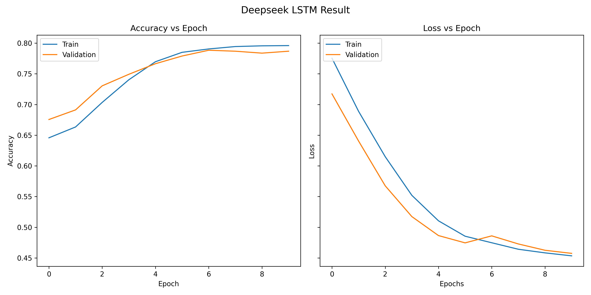
</p>

- The graph above shows the evaluation metrics of an LSTM model trained using the Deepseek review dataset. In the left image, both training (blue) and validation (orange) accuracy improved with each iteration.

- The figure on the right illustrates how close the model's prediction align with the actual outcomes. The loss decreases steadily as the number of epochs increases, as measured by the loss function. Using the Deepseek review training dataset for 10 epochs, the model achieved an accuracy of about 0.80 (80%) with a loss of 0.45 (45%). On the validation data, it reached an accuracy of approximately 0.78 (78%) with the same loss of 0.45 (45%). In addition, the training and validation curves remain close to each other, suggesting that the model is generalizing well and not overfitting.

<p align = center>
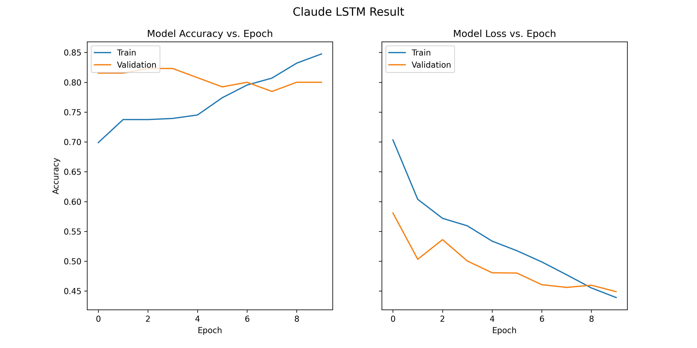
</p>

- The graph above shows an LSTM model trained using Claude chatbot app review data. In terms of accuracy, the model trained with the training data (blue) increased from 0.7 to 0.85. Conversely, when the model was validated (orange), its accuracy dropped slightly from around 0.82 (82%) to 0.78 (78%).

- In the loss plot on the left, the validation curve (orange) initially outperformed the training curve (blue) during the first epoch. By the 10th epoch, however, both had decreased to a loss value of 0.54 (54%).

<p align = center>
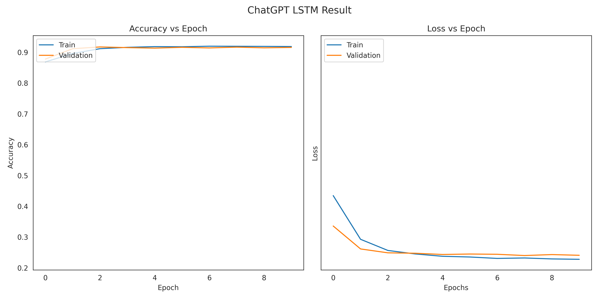
</p>

- The model trained using ChatGPT review data performed better than the model trained using the review data from the two previous chatbots. The left figure shows accuracy, both with training and validation data, with scores around 0.9 (90%).

- The right-hand graph shows the loss score across epochs. It drops from around 0.45 (45%) to 0.25 (25%) on the training run, and from 0.35 (35%) to 0.25 (25%) on the validation run.

### Comparison of Lexicon and LSTM

This sub-chapter is devoted to discussing the accuracy comparison between the LSTM and Lexicon models trained with the review dataset of three chatbot applications.

<p align = center>
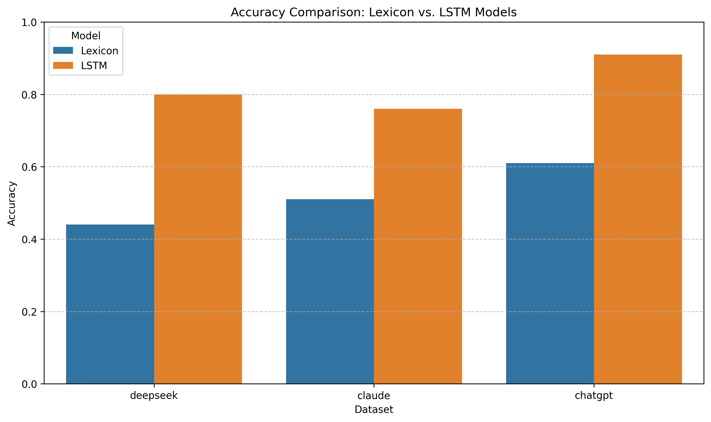
</p>

- **Lexicon vs LSTM**: In this project, the lexicon-based accuracy scores for DeepSeek, Claude, and ChatGPT ranged from 0.4 to 0.6, while the LSTM model achieved between 0.8 and 0.9. The superior performance of LSTM can be attributed to its ability to learn and capture vocabulary patterns directly from the training data, enabling it to better understand the context of user reviews. In contrast, the lexicon method relies on external resources such as sentiment dictionaries, which must be sufficiently comprehensive to evaluate whether a review is positive or negative. Since the dictionary developed in this project lacked vocabulary coverage and linguistic diversity, many reviews were misclassified as neutral, limiting the overall accuracy of the lexicon approach.

- **Dataset**: Models trained on the ChatGPT review dataset achieved higher performance with both the lexicon and LSTM approaches compared to DeepSeek and Claude. This improvement is largely due to the significantly larger volume of data collected for ChatGPT, which provided a wider variety of user reviews. A larger and more diverse dataset allows the models to capture richer linguistic patterns and better understand the context of each review, leading to improved accuracy (Hatamian et al. 2025).

## Conclusion

The conclusion obtained from this project is:

1. In terms of accuracy, the performance of the LSTM model surpasses the Lexicon method.

2. The model from the ChatGPT chatbot review dataset managed to achieve a higher accuracy score than Deepseek and Claude, both with the Lexicon and LSTM models due to the large number of the review dataset.

3. Based on the exploratory analysis, positive reviews of the three chatbot applications often highlighted that the apps helped users answer questions, while negative reviews frequently pointed to technical problems as the main shortcomings.

## Reference

- Smagulova, K., & James, A. P. (2019). A survey on LSTM memristive neural network architectures and applications. European Physical Journal: Special Topics, 228(10), 2313–2324. https://doi.org/10.1140/epjst/e2019-900046-x

- Caterini, A. L., and Chang, D.E. (2018). Recurrent neural networks. SpringerBriefs in Computer Science. Springer. https://doi.org/10.1007/978-3-319-75304-1_5

- Hutto, C., & Gilbert, E. (2014). VADER: A Parsimonious Rule-Based Model for Sentiment Analysis of Social Media Text. Proceedings of the International AAAI Conference on Web and Social Media, 8(1), 216-225. https://doi.org/10.1609/icwsm.v8i1.14550

- Hatamian, M., et al. (2025). [Exact title of the paper]. arXiv preprint arXiv:2501.XXXXX. https://doi.org/10.48550/arXiv.2501.XXXXX

## Appendix A: LSTM Parameter

### Deepseek 

| Parameter | Information |
|--|--|
|Number of Neuron |64|
|Dropout|0.3|
|Recurrent Dropout|0.3|
|L2 kernel regularizer|0.001|
|Optimizer|Adam|
|activation|sigmoid|
|Loss|binary crossentropy|
|epochs|10|
|batch size|128|
|validation split|0.2|

### Claude

| Parameter | Information |
|--|--|
|Number of Neuron |64|
|Dropout|0.01|
|Recurrent Dropout|0.1|
|L2 kernel regularizer|0.001|
|Optimizer|Adam|
|activation|sigmoid|
|Loss|binary crossentropy|
|epochs|10|
|batch size|64|
|validation split|0.2|

### ChatGPT

| Parameter | Information |
|--|--|
|Number of Neuron |64|
|Dropout|0.3|
|Recurrent Dropout|0.3|
|L2 kernel regularizer|0.001|
|Optimizer|Adam|
|activation|sigmoid|
|Loss|binary crossentropy|
|epochs|10|
|batch size|128|
|validation split|0.2|


## Appendix B: Visualization

## Appendix C: Build a Sentiment Model
 